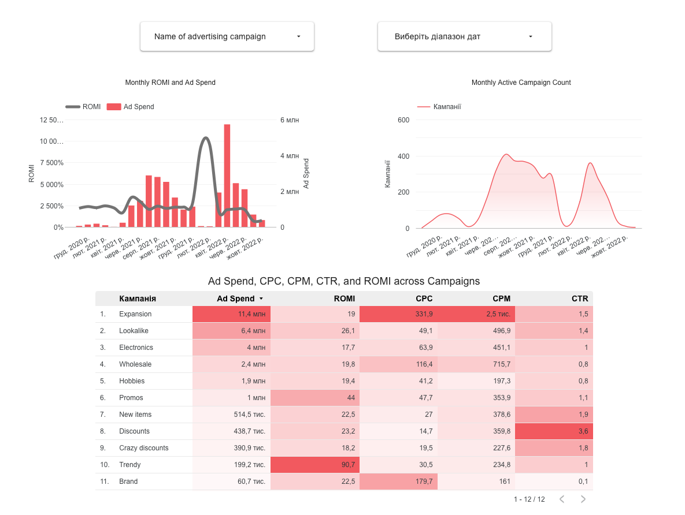

# Advertising Campaign Performance Dashboard

This project is a data visualization dashboard built in Looker Studio. It analyzes the performance of advertising campaigns using data from a PostgreSQL database.

The dashboard helps to track key performance metrics across campaigns and visualize how these metrics change over time.

## Tools used
- PostgreSQL as the data source
- Looker Studio for building the dashboard

## What the dashboard shows
- ROMI (Return on Marketing Investment) and Ad Spend over time
- Number of active campaigns by month
- CPC, CPM, CTR, and ROMI for each campaign
- Interactive filters for campaign name and date range

## Preview

## View online
[Open the dashboard in Looker Studio](https://lookerstudio.google.com/reporting/c1f1f0cb-fdcd-4b00-9dd1-d02a0f2c7dcf)
